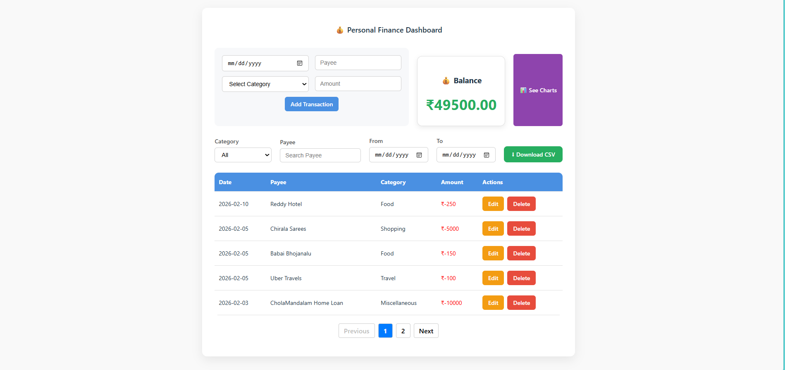
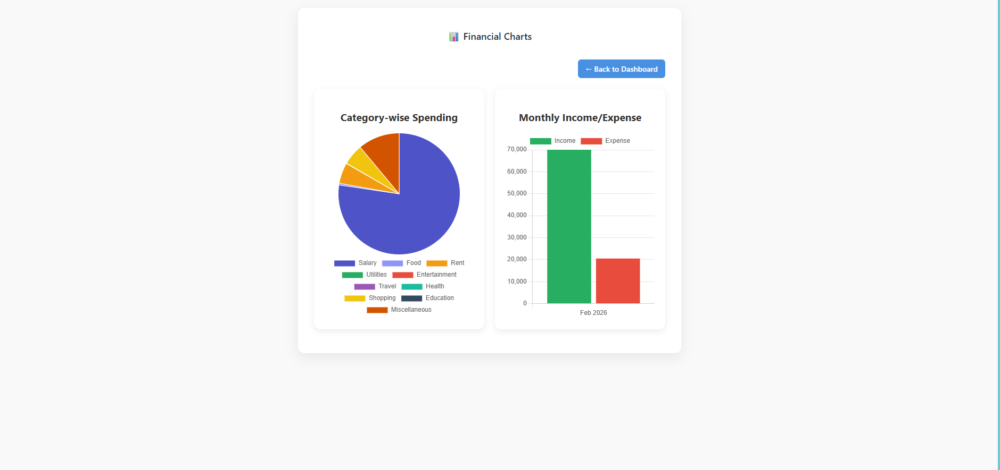

📌 Personal Finance Tracker

A full-stack Personal Finance Management application that helps users track income and expenses, monitor balance, and visualize financial data through interactive charts.

🚀 Live Demo

(We will add deployment links after hosting)

🛠️ Tech Stack
Frontend:
ReactJS
Vite
Axios
Chart.js
React Toastify

Backend
NodeJS
ExpressJS
MongoDB
Mongoose

✨ Features
💰 Balance Management
Shows Available Balance
Displays Negative Balance if expenses exceed income
Auto-updates after every transaction

➕ Transaction Management

Add Transaction (Payee, Date, Category, Amount)
Update Transaction
Delete Transaction
Pagination support
Real-time balance update

🔍 Advanced Filtering

Search by:
Category
Date
Payee
Download CSV:

Filtered Data
All Transactions

📊 Data Visualization
Pie Chart → Shows expense distribution by category
Bar Chart → Shows Income vs Expenses comparison

🔔 Notifications
Toast notifications for:
Add
Update
Delete
Cancel actions

📂 Project Structure

PersonalFinanceTracker
│
├── Backend
│   ├── server.js
│   ├── package.json
│
├── Frontend
│   ├── src
│   ├── package.json

⚙️ Installation & Setup
1️⃣ Clone Repository
git clone https://github.com/BhuvanaPravallika/PersonalFinanceTracker.git
cd PersonalFinanceTracker

2️⃣ Backend Setup
cd Backend
npm install
npm start

Server runs on:
http://localhost:4000

3️⃣ Frontend Setup
cd Frontend/frontend
npm install
npm run dev

Frontend runs on:
http://localhost:5173

## 📊 Screenshots

### 🏠 Dashboard

### 📈 Financial Charts

🌟 Future Enhancements

User Authentication
Monthly Reports
Dark Mode
Export PDF Reports

👩‍💻 Author
Bhuvana Pravallika
GitHub: https://github.com/BhuvanaPravallika

